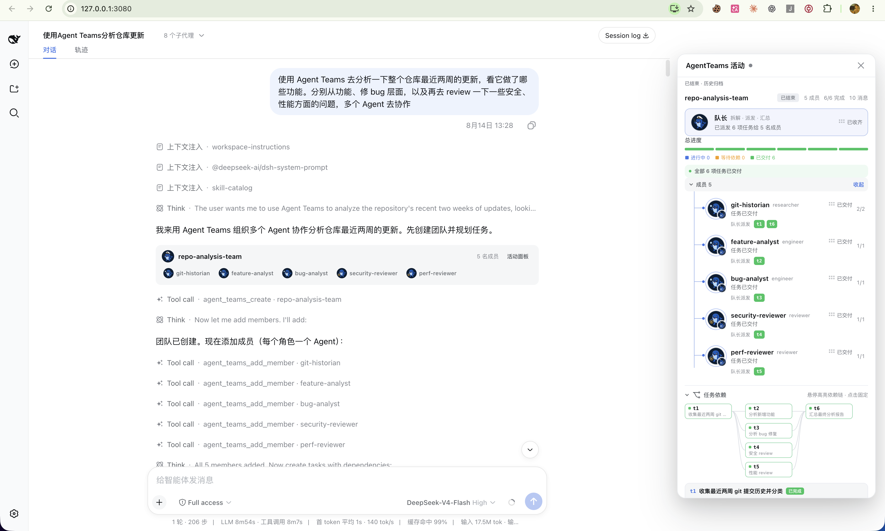

[English](README.md) | 中文

<p align="center">
  
</p>

<p align="center">
  <a href="./LICENSE"></a>
  
</p>

## 一句话，拉起一支真正协作的团队

`dsh-agent-teams` 让当前 DeepSeek Harness 会话成为队长：创建可续聊的子 Agent、把目标拆成有依赖的任务，并通过直达消息协调成员工作。

你只需用自然语言提出目标。插件会提供团队协议、17 个协作工具、持久化状态、自动共享任务调度和实时 Web UI，不需要额外的 Workflow 引擎。

<p align="center">
  
</p>

## 为什么需要 AgentTeams？

| 能力 | 带来的变化 |
| --- | --- |
| **队长式委派** | 当前会话负责建队、分配角色并汇总最终结果。 |
| **可续聊成员** | 成员是可持续唤醒的 DSH 子 Agent，可以继续执行聚焦的后续轮次。 |
| **带依赖的任务** | 任务有明确状态；依赖未完成时不能领取。 |
| **自动续领与安全接管** | 成员空闲后自动领取下一项就绪任务；转派会撤销旧 attempt，冷恢复会重试遗留任务，迟到结果无法覆盖。 |
| **成员直达消息** | 成员通过持久化邮箱直接联系队友或队长，不需要队长中转。 |
| **实时活动面板** | Web UI 用分段进度、可折叠成员树和可交互 DAG 展示实时工作；团队结束后仍保留完整成员与任务历史。 |

## 安装

> [!NOTE]
> 使用前请确保已安装 [DeepSeek Harness](https://github.com/deepseek-ai/deepseek-harness)。

### 从当前工作区构建

`@byclaw/dsh-agent-teams` 是 DeepSeek Harness 的私有工作区包，不发布到 npm registry，必须从当前检出目录安装。

```sh
cd /path/to/deepseek-harness
pnpm install
pnpm --filter @byclaw/dsh-agent-teams run build
dsh plugin --profile web add /path/to/deepseek-harness/plugins/agent-teams
```

修改插件源码后请重新执行该过滤构建命令。本地安装会继续链接到当前源码目录。

检查组合配置、重启 DSH，然后刷新 Web UI：

```sh
dsh --profile web --dump-config
dsh web
```

接着直接用自然语言拉团队：

> 使用 AgentTeams 审查 v0.5.3 之后的提交，分别从性能、安全和产品角度分工，最后输出一份汇总报告。

## 工作方式

1. 当前会话创建团队并成为队长。
2. 队长按角色添加由可续聊子 Agent 驱动的成员。
3. 目标被拆成有负责人和显式依赖的任务。
4. 共享调度器依据真实 `running / idle / ready` 状态，为每个空闲成员原子领取一项就绪任务并唤醒它；成员在中断或进程重启后仍持有开放任务时，会以新 attempt 自动恢复执行。
5. 成员携带当前 `attempt_id` 更新任务；转派或队长接管会先撤销旧 attempt、等待原成员安静，再启动新 attempt。
6. 队长汇总结果，随后归档完整团队记录。

团队状态保存在 `<workspace>/.agent-teams/`；Web 面板读取这份磁盘真相，并与实时子 Agent 活动合并展示。

成员创建默认零交互：插件会快照队长**当前这一步**实际使用的 LLM provider、model 与思考强度，成员后续续跑仍使用这份快照。只有当用户明确提出异构分工（例如“后端用 provider A/model X，前端用 provider B/model Y”）时，队长才会把对应的 `provider` + `model` 传给该成员；不会逐个弹出模型或思考强度选择。

## 配置

默认配置可以直接使用。受信任的 Profile 可以覆盖成员行为：

```yaml
- id: agent-teams
  config:
    stateDir: .agent-teams
    memberProvider: spawn
    memberModel: deepseek-v4
    memberMaxDepth: 1
    maxMembers: 8
    controlledWorkflow: true
    maxTaskAttempts: 3
    catalogDir: /absolute/path/to/agent-teams-catalog
```

这里的 `memberProvider` 指子 Agent 的运行后端（`spawn` / `fork`），不是 LLM provider。跨 LLM provider 由 `agent_teams_add_member` 的可选 `provider` + `model` 参数表达；`memberModel` 只是所有成员的模型默认覆盖。

开启 `controlledWorkflow: true` 后，队长必须为每个任务给出 description、dependencies（包括 `[]`）、assignee、acceptance_criteria 和 required_tools（包括 `[]`），再且只能在完整 DAG 就绪后调用一次 `agent_teams_start`。`catalogDir` 保存机器全局的专家模板和运行实例指针，应放在不受不可信工作区控制的位置；`maxTaskAttempts` 限制自动重试次数。

## Catalog 与 Claude Code 成员

`agent_teams_save_template` 把当前团队的成员名册写入 `catalogDir`，`agent_teams_list_templates` 读取可复用名册；全局实例工具只能查看运行团队元数据，不会取得该团队的控制权。安装可选 ByClaw 代际协调器后，模板列表读取和基于模板的 `agent_teams_create` 使用共享准入，模板保存使用独占准入。集成卸载期间协调器保持关闭式拒绝，因此刷新过程不会在已准入操作期间替换成员名册或 Skill 文件，也不会覆盖无关的并发保存。

`agent_teams_add_member` 可传入 `runtime: claude-code`，由本机已安装的 Claude CLI 执行。该成员只收到自包含任务提示，不拥有 Harness 工具；Claude 会话以净化后的路径段保存在团队 inbox 中，并在后续任务恢复。子进程只继承运行所需变量与已配置的 Claude 认证输入，绝不继承完整宿主环境。

## 使用边界

- 一个队长同一时间只能带一个活动团队。
- 成员空闲后由共享调度器自动续领就绪任务；中断/冷重启遗留的开放任务会生成新 attempt 并重新唤醒原成员；暂时无法实时投递的消息会持久保存在邮箱中并在后续状态边界重投。
- 状态使用文件持久化，并在单个 DSH 进程内串行操作；多个进程同时修改同一团队不保证一致。
- 活动面板如实展示持久化状态；模型偶尔可能完成工作却没有按协议更新任务状态。

完整工具列表、状态模型、Web UI 行为、配置与已知限制见 [docs/usage.md](./docs/usage.md)。

## 插件开发 Skill

仓库同时提供开放 Agent Skills 包 [`dsh-plugin-development`](./skills/dsh-plugin-development/SKILL.md)：

```sh
npx skills add NanmiCoder/dsh-agent-teams --skill dsh-plugin-development
```

## 文档

| 指南 | 内容 |
| --- | --- |
| [使用指南](./docs/usage.md) | 架构、UI 行为、工具、配置、限制与验证 |
| [验证指南](./docs/verification-guide.md) | 离线、组合、真实 e2e 与 GUI 验证 |
| [插件开发](./docs/developing-dsh-plugins.md) | 基于本插件整理的人类可读开发指南 |
| [README 写作](./docs/readme-writing-guide.md) | 仓库文档约定 |

## 开发

```sh
pnpm install
pnpm build
pnpm verify
```

## 许可证

[MIT](./LICENSE)
