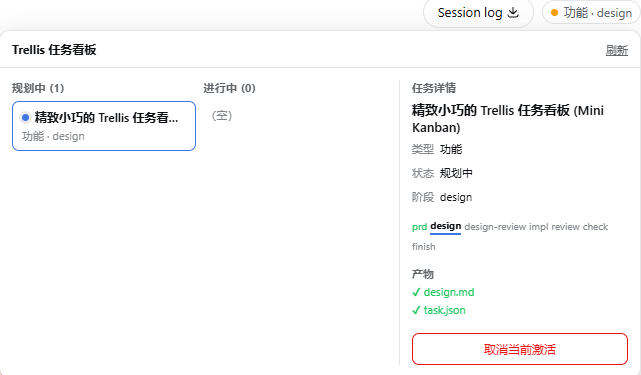

# dsh-trellis

> ByClaw 维护版本：包名为 `@byclaw/dsh-trellis`，从本仓库的 `plugins/dsh-trellis` 安装。上游版本与提交见 [UPSTREAM.md](./UPSTREAM.md)。下文功能说明沿用上游文档。

<!-- Hero -->
<div align="center">
  <b style="font-size: 1.25em;">Trellis 工作流适配进 DeepSeek Harness</b><br />
  <sub>让 AI 编程先规划后动手 · 步骤清晰 · 阶段可视 · 告别失控</sub><br /><br />
  <a href="https://opensource.org/licenses/MIT"></a>
  
  
  
  
  <br /><br />
  <b>每轮对话自动注入任务状态面包屑</b>，把 15+ <code>trellis-*</code> 工作流技能随项目自动补齐，<br />
  并提供开箱即用的任务管理工具与 Web 端可视化阶段徽标 / Mini 任务看板。
</div>

<div align="center">
  🌏 <a href="./README.md"><b>中文</b></a> · <a href="./README_EN.md">English</a>
</div>

<br />

<p align="center">
  
  
</p>

---

## 💡 为什么需要 dsh-trellis？

在日常使用 AI Agent 写代码时，你是否经常遇到这些痛点：
- 🤯 **聊着聊着就跑偏**：多轮对话后，AI 忘了原本的目标是什么，开始乱改不相干的代码。
- 🏃 **不假思索直接瞎写**：提一个新需求，AI 连架构和影响面都没搞清楚就直接写代码，产生大量回归 Bug。
- ❓ **进度完全黑盒**：不知道 AI 到底在做需求设计、写代码还是在做测试，卡住了也难以排查。

**`dsh-trellis` 把成熟的 [Trellis](https://github.com/mindfold-ai/trellis) 结构化工程工作流带到了 [DeepSeek Harness (DSH)](https://github.com/deepseek-ai/deepseek-harness)。**

它让 AI 像资深工程师一样工作：
1. 🧠 **有记忆、不迷路**：每轮对话开始时，插件会自动将当前任务进度和阶段目标提醒给 AI。
2. 📐 **先规划、后动手**：遵循规范的工作流——做功能先写 PRD/方案，修 Bug 先分析定位，通过审查验收后再归档。
3. 📊 **直观可视化**：Web 界面右上角常驻当前任务徽标，点击一键展开任务看板与阶段进度，随时切换与回顾。
4. 🪶 **轻量零负担**：纯 Node.js ESM 实现，零外部依赖，不需要 Python，不侵入项目源码。

---

## ⚡ 30 秒极速上手

### 1. 安装插件

确保环境满足 Node.js ≥ 20 且 DSH 正常运行，在终端执行：

```sh
# 安装插件
dsh plugin --profile web add @byclaw/dsh-trellis

# 更新插件到最新版本
dsh plugin --profile web add @byclaw/dsh-trellis@latest

# 本地源码开发安装
dsh plugin --profile web add link:/abs/path/to/dsh-trellis
```

安装完成后，**重启一次 DSH 服务**。

### 2. 添加项目到白名单

插件默认不拦截未授权的项目。重启后，只需在 Web 界面完成一次配置：

1. 刷新 DSH 浏览器页面。
2. 点击左下角 **设置 → 插件 → Trellis 工作流**。
3. 在 **白名单项目 (allowlist)** 中填入你的项目绝对路径（如 `/home/user/my-project` 或 `D:/projects/my-project`），点击保存即可**即时生效**。

> 💡 也可以直接在 `~/.dsh/settings.yaml` 中配置 `trellis-workflow.allowlist`，详见下方配置章节。

### 3. 开始使用！

在会话中直接像平时一样提需求即可，例如：
> *“帮我在用户系统里加一个微信扫码登录功能”*

AI 将会自动识别意图，引导你创建 Trellis 任务（如 `feat-08-20-wechat-login`），生成 PRD 需求规划，一步一步稳健推进！

---

## 🧭 三大内置工作流

`dsh-trellis` 内置了三套经过实战检验的标准工程流，由路由表自动分发：

| 工作类型 | 入口技能 | 标准推进流程 | 适用场景 |
|---|---|---|---|
| **新功能开发** | `trellis-feat` | `需求规划 (prd)` → `方案设计 (design)` → `方案评审 (review)` → `代码实现 (impl)` → `代码审查 (review)` → `质量验收 (check)` | 新增功能、重构改版。支持快速通道 (quick) 与标准通道 (standard) |
| **缺陷修复** | `trellis-issue` | `问题报告 (report)` → `根因分析 (analyze)` → `精准修复 (fix)` → `修复记录 (fix-note)` | Bug 修复、异常排查、性能回归。遇死循环可自动调用 `trellis-break-loop` |
| **行为重构** | `trellis-refactor` | `代码扫描 (scan)` → `重构方案 (design)` → `实施改造 (apply)` | 保持外部行为不变的代码优化、结构拆分、技术债清理 |

### 🚀 快速通道 vs 🛡️ 标准通道
- **快速通道 (`quick`)**：适用于局部小改动、挂载点明确的轻量任务，跳过繁重评审直接进入实现与验证。
- **标准通道 (`standard`)**：关键节点设置**人工卡点**（如设计方案必须经由用户确认、代码必须通过独立 review 与测试验收后方可归档），适合中大型复杂特性。

---

## ✨ 核心特性一览

### 1. 🧭 静默且聪明的状态提醒（面包屑注入）
- 每当用户发送一条新消息时，插件会自动在首步为 AI 注入当前任务状态（包含当前处于哪个阶段、下一步该做什么）。
- **不刷屏**：仅在每轮新消息的首步提醒，中间工具调用步骤保持干净。
- **随时逃生**：只要用户消息中包含 `no-trellis` 关键字，该轮对话即完全跳过工作流拦截。

### 2. 🧩 15+ 工作流技能随项目自动供给
- 随包内置 15 个经过精细调优的 `trellis-*` 技能及模板（位于包内 `skills/`）。
- 打开会话时，插件会自动检查项目根目录的 `.agents/skills/`，**缺什么补什么**，无需手动复制或修改 Profile。
- 项目自身可以自由修改已生成的技能副本；如果不小心删除了，下一轮会自动补齐。

### 3. 🏷️ Web 阶段徽标 & Mini 任务看板
- 会话标题右侧优雅嵌入当前阶段徽标（如 `功能 · design`）。
- 点击/悬停可展开当前工作类型的完整阶段轨道。
- 点击可呼出 **Mini 任务看板**：
  - 🔄 **快速切换**：在多个活跃任务之间一键切换会话绑定。
  - 🗄️ **归档折叠**：自动按月份（如 `2025-08`）折叠已完成的历史任务，清晰易查。
- 极致性能：全部基于 Host 端只读缓存摘要，浏览器端纯展示，绝不触发额外耗时扫描。

### 4. 🛠️ 规范化的任务全生命周期工具
- `trellis_task_create`：一键创建任务目录、初始化产物模板（prd/design）、规范命名格式（`<type>-<mm-dd>-<name>`），并同步绑定到当前会话。
- `trellis_task_update`：原子化更新任务阶段（`stage`）与状态（`status`），自动校验阶段转移合法性并刷新界面徽标。
- `trellis_task_archive`：任务完成后，一键移入归档目录，自动解绑会话指针，保持看板清爽。
- `trellis_state`：随时诊断当前项目所处的工作流阶段与健康度。

---

## ⚙️ 详细配置

插件支持通过 **Web 界面**（推荐）、**用户全局配置** 或 **Profile 补丁** 进行配置：

### 配置项说明

| 配置字段 | 类型 | 默认值 | 说明 |
|---|---|---|---|
| `allowlist` | `string[]` | `[]` | **核心白名单**：生效的项目根绝对路径列表。为空时不拦截任何项目 |
| `injectStep` | `number` | `1` | 面包屑注入步数（默认 1，即每个新提问的首步注入） |
| `skipKeywords` | `string[]` | `['no-trellis']` | 只要消息中包含这些单词，该轮对话不注入工作流面包屑 |
| `inline` | `boolean` | `false` | 是否开启 codex-inline 风格的阶段解析 |

### 方式一：Web 设置界面（免重启、即时生效）

1. 重启 DSH 后，访问左下角 **设置 → 插件 → Trellis 工作流**。
2. 增删白名单路径或调整参数，点击保存即刻写入生效。

### 方式二：用户配置文件（`settings.yaml`，热重载）

编辑 `~/.dsh/settings.yaml`（Windows 为 `%USERPROFILE%\.dsh\settings.yaml`）：

```yaml
trellis-workflow:
  allowlist:
    - /home/bananapeel/my-awesome-project
    - /mnt/d/code/another-project
  injectStep: 1
  skipKeywords:
    - no-trellis
  inline: false
```

<details>
<summary><b>方式三：Profile 配置文件（cordis.patch.yml）</b></summary>

在当前使用的 profile 的 `cordis.patch.yml` 中直接声明：

```yaml
- id: trellis-workflow
  name: '@byclaw/dsh-trellis'
  config:
    allowlist:
      - /path/to/your/project
    injectStep: 1
    skipKeywords: ['no-trellis']
    inline: false
```
</details>

---

## 🛠️ 二次开发与架构说明

### 目录结构

```text
dsh-trellis/
├── package.json            # npm 插件包元数据（@byclaw/dsh-trellis, MIT）
├── cordis.patch.yml        # dsh.bundle 自动挂载层声明
├── lib/
│   ├── index.js            # 插件总入口：注册 pre-step 拦截器、生命周期、RPC 路由与工具集
│   ├── task.js             # 任务创建与更新：slug 规范校验、模板初始化、session 指针同步
│   ├── archive.js          # 任务归档：原子迁移至 archive/<yyyy-mm>/、解绑指针
│   ├── resolve.js          # 路径解析：基于 cwd 识别项目根与 .trellis 资产
│   ├── state.js            # 状态机：解析会话绑定、读取当前 stage、组装摘要与阶段轨道
│   ├── breadcrumb.js       # 构造每轮向 AI 注入的提示词与逃生词过滤
│   ├── trust.js            # 本地回环同源安全校验（防御 DNS-rebinding）
│   ├── skills.js           # 技能供给：按需向项目 .agents/skills/ 补齐权威副本
│   ├── settings.js         # Web 设置页命名空间注册与存储交互
│   └── meta.js             # 配置项 Schema 与默认值
├── skills/                 # 15 个随包权威技能副本
│   ├── trellis-*/SKILL.md  # 技能正文定义
│   └── _templates/         # 任务产物模板 (prd/design/review 等) 与路由表
└── scripts/
    └── install.mjs         # 独立辅助安装脚本
```

### 技术要点
- **零构建、纯标准 ESM**：无 TypeScript 编译负担，改动即生效。
- **只读缓存隔离**：Web 端的查询请求只命中内存只读缓存，杜绝频繁读取磁盘。
- **沙箱与安全隔离**：文件操作全部遵循 DSH 的 `ctx.fs` 沙箱安全规范，避免越权访问。

---

## ❓ 常见问题（FAQ）

<details>
<summary><b>Q1: 安装后对话没有出现 Trellis 提醒？</b></summary>

- **检查白名单**：默认情况下 `allowlist` 为空。请在 Web 设置或 `settings.yaml` 中将当前项目的根目录绝对路径加入 `allowlist`。
- **检查服务重启**：插件刚安装后需要重启一次 DSH 服务，并硬刷新浏览器（`Ctrl+F5` 或 `Cmd+Shift+R`）。
- **检查逃生词**：确认提问中没有触发 `no-trellis` 关键字。
</details>

<details>
<summary><b>Q2: Web 设置页没有看到「Trellis 工作流」选项？</b></summary>

- 若当前 DSH 版本未对第三方插件暴露设置页，可运行 `node scripts/install.mjs --patch-harness` 一键补丁；或者直接编辑 `~/.dsh/settings.yaml` 中的 `trellis-workflow:` 段落（同样支持热重载，无需重启）。
</details>

<details>
<summary><b>Q3: 如何彻底卸载？</b></summary>

```sh
dsh plugin --profile web remove @byclaw/dsh-trellis
```
如果需要清理本地 link 缓存残留，可执行 `node scripts/install.mjs --uninstall --profile web`。
</details>

---

## 🙏 致谢

- **[Trellis](https://github.com/mindfold-ai/trellis)**（作者 [Mindfold](https://mindfold.ai)，AGPL-3.0-only）：
  感谢 Mindfold 团队开源了出色的 Trellis 工作流思路。本项目仅移植了其**流程语义**（阶段轨道、任务产物规范与面包屑机制），代码与技能内容均为独立重写，不包含任何 AGPL 源码，以 MIT 许可证发布。
- **[CodeStable](https://github.com/codestable/CodeStable)**：
  感谢 CodeStable 团队，内置的三大工作流（feat / issue / refactor）结构通用化改编自其优秀的工程化设计思路。
- **[DeepSeek Harness](https://github.com/deepseek-ai/deepseek-harness)**：
  强大的大模型 Agent 运行时底座。

---

## 📄 开源许可证

本项目基于 [MIT 许可证](./LICENSE) 开源发布。
